# Cardiac-Regenerative-Lab-Autocrawler

An end-to-end, multi-stage pipeline designed by Virelion Biotech to discover, extract, deduplicate, score, and monitor global academic and translational research laboratories specializing in **cardiac regeneration, engineered heart tissue (EHT), direct reprogramming, stem cell therapy, and biological pacing**.

By orchestrating academic literature APIs, global grant repositories, clinical trial registries, patent databases, and dynamic web crawlers, alongside LLM structured extraction, `cardiac_lab_finder` generates an exhaustive, active database of global PIs and research groups — complete with annual diff tracking, a funding leaderboard, and a clinical trial landscape dashboard.

Run once a year, by hand. No scheduler, no orchestration framework, no self-healing retry loops — a human triggers each step in sequence, which keeps the system simple and easy to reason about between runs.

---

## 📐 Architecture & Pipeline Overview

The engine operates as a sequential modular pipeline with data stored and versioned by run year (`data/YYYY/`).

```mermaid
graph LR
    subgraph Ingestion["Ingestion Layer"]
        A1[1. Academic Papers - PubMed/PMC]
        A2[2. Grant DBs - NIH RePORTER]
        A3[3. Clinical Trials]
        A4[4. Targeted Web Crawling]
        A5[10. Patents - USPTO PatentsView]
    end

    subgraph Intelligence["Intelligence & Resolution"]
        B1[5. Relevance Filtering - Claude]
        B2[6. Structured Field Extraction]
        B3[7. Entity Deduplication - ORCID/Email]
    end

    subgraph Analytics["Scoring & Reporting"]
        C1[8. Activity & Risk Scoring - AVI]
        C2[9. CSV Report & Annual Diffing]
        C3[11. Funding Leaderboard]
        C4[12. Trial Landscape Dashboard]
    end

    Ingestion --> Intelligence --> Analytics
```



Steps 11 and 12 are standalone reporting scripts — they read from `labs_final.json` and `raw_trials.json` respectively and don't feed back into the core pipeline.

---

## 📁 Repository Structure

```text
cardiac_lab_finder/
├── config.py                          # Core configuration: search terms, API keys, output paths
├── 1_harvest_papers.py                # PubMed, Europe PMC (incl. bioRxiv/medRxiv preprints) → raw_papers.json
├── 2_harvest_grants.py                # NIH RePORTER (Horizon Europe/UKRI stubbed, fast-follow) → raw_grants.json
├── 3_harvest_trials.py                # ClinicalTrials.gov v2 (EU CTR stubbed, fast-follow) → raw_trials.json
├── 4_crawl_lab_pages.py               # robots.txt-respecting crawler of seed institution directories → raw_lab_pages.json
├── 5_classify_relevance.py            # LLM Classifier (Claude): filters non-cardiac/non-regen noise → filtered.json
├── 6_extract_structured.py            # LLM Extractor (Claude): converts raw data to structured schema → labs_extracted.json
├── 7_resolve_entities.py              # Entity resolution & PI dedup (ORCID/email/name+institution) → labs_deduped.json
├── 8_score_and_enrich.py              # Activity Verification Index (AVI), funding totals, risk tags → labs_final.json
├── 9_export_csv.py                    # Final CSV export + year-over-year diff summary → labs_report.csv
├── 10_harvest_patents.py              # USPTO PatentsView patent search → raw_patents.json
├── 11_export_funding_leaderboard.py   # Top-funded labs + institution-level funding rollup
├── 12_export_trial_dashboard.py       # Self-contained HTML dashboard of the clinical trial landscape
├── requirements.txt                   # Pinned dependency manifest
└── data/
    ├── 2026/                          # Current run artifacts (raw data, intermediate states, final outputs)
    └── 2025/                          # Prior run data (used for delta/diff calculations)
```

---

## ✨ Key Features

- **Multi-Source Ingestion:** Aggregates data from scientific publications (incl. preprints), active grants, clinical trial registries, patents, and institutional websites.

- **LLM Domain Filtering:** Uses Anthropic's Claude API to eliminate false positives (e.g., non-regenerative clinical cardiology or general non-cardiac stem cell research).

- **Schema-Enforced Extraction:** Hybrid approach — pulls PI/institution/location fields deterministically wherever a source already provides structured data (papers, grants, trials, patents), and uses Claude only for genuinely judgment-heavy fields (research focus categorization, translational stage) and for unstructured crawled lab pages.

- **Canonical Entity Resolution:** Unifies author variations (e.g., "J. Wu" vs. "Joseph C. Wu") across all five sources using ORCID, email, and name+institution matching. Institution matching is based on distinctive-token overlap rather than raw string similarity, so a university and its own sub-institute (e.g. "Stanford University" vs. "Stanford Cardiovascular Institute") correctly resolve to the same entity.

- **Activity Verification Index (AVI):** Scores each lab as Active / Aging / Inactive-Legacy / Unknown based on the most recent dated evidence (publication year, grant fiscal year, trial date, or patent date) across all of its merged source records.

- **Automated Year-over-Year Diffing:** Compares output against the most recent prior run to highlight newly discovered labs, significant funding shifts, newly inactive labs, and possible institutional migrations. *(Note: migration detection currently requires the same name+institution match used for entity resolution, so it won't catch a PI who moves to a completely different institution with no shared identifying token — that case shows up as a new lab instead. A more reliable fix would need a stable identifier like ORCID, which isn't always available in harvested data.)*

- **Funding Leaderboard:** Publishes both a lab-level ranking and an institution-level funding rollup from the same NIH RePORTER data already harvested in step 2 — no additional harvesting required.

- **Clinical Trial Landscape Dashboard:** A single self-contained HTML file (Chart.js via CDN) visualizing trial phase distribution, status, top sponsors, geography, and year-over-year trial starts. Opens directly in a browser, no server required.

---

## ⚙️ Core Extracted Schema

Each identified lab profile contains the following structured fields:

- **PI Identification:** Full Name, Canonical Name, AKA Names, ORCID, Email, Institutional Profile URL.

- **Affiliation:** Primary Department, University/Institute, City, Country, Geographic Coordinates *(currently left null — geocoding is a fast-follow addition)*.

- **Core Research Focus:**
  - *Cell & Gene Sources:* hiPSC-CMs, ESC-CMs, direct lineage reprogramming, cardiac progenitors, mRNA therapies.
  - *Constructs & Bioengineering:* Engineered Heart Tissue (EHT), cardiac patches, decellularized matrices, 3D bioprinting.
  - *Functional Vectors:* Biological pacing, electromechanical integration, arrhythmia mitigation, vascularization, metabolic maturation.

- **Experimental Models:** In vitro, Small Animal, Large Animal.

- **Translational Stage:** Discovery/Basic Science through Clinical Trial Phase III.

- **Metrics:** Active Grant Funding ($USD, summed across merged records), Clinical Trial Identifiers, Patent IDs.

- **Activity Verification Index:** Status (Active/Aging/Inactive-Legacy/Unknown), numeric AVI score, most recent activity year.

- **Risk Flags:** Electromechanical risk profile (flags labs whose functional vectors include electromechanical integration or arrhythmia mitigation).

- **Translation & Scale Metrics:** Grant funding; citation impact and industry/startup spinoff affiliation are left `null` pending fast-follow data sources (Semantic Scholar citation counts, and no current source for spinoff affiliation).

---

## 🚀 Quickstart Guide

### 1. Prerequisites

Python 3.10+. Install dependencies:

```bash
cd cardiac_lab_finder
pip install -r requirements.txt
```

### 2. Environment Setup

Set the following environment variables (or use a `.env` file):

```bash
# Required
export ANTHROPIC_API_KEY="your-claude-api-key"
export NCBI_EMAIL="your-email@institution.edu"        # required by NCBI's Entrez usage policy

# Optional but recommended
export NCBI_API_KEY="your-ncbi-key"                    # raises PubMed rate limit from 3 to 10 req/sec
export SEMANTIC_SCHOLAR_API_KEY="your-key-if-available"
export USPTO_PATENTSVIEW_API_KEY="your-free-patentsview-key"  # required for step 10 — register at https://patentsview.org/apis/keyrequest
```

Before your first run, also populate `config.CRAWL_SEED_DIRECTORIES` in `config.py` with real, public, non-gated university/institute directory URLs — step 4 will run but find nothing until this list is filled in.

### 3. Execution Pipeline

Run scripts in order:

```bash
# Ingestion
python 1_harvest_papers.py
python 2_harvest_grants.py
python 3_harvest_trials.py
python 4_crawl_lab_pages.py
python 10_harvest_patents.py

# Processing & LLM structuring
python 5_classify_relevance.py
python 6_extract_structured.py
python 7_resolve_entities.py

# Scoring & core report
python 8_score_and_enrich.py
python 9_export_csv.py

# Standalone reports (optional, run any time after step 8/3 respectively)
python 11_export_funding_leaderboard.py
python 12_export_trial_dashboard.py
```

---

## 📊 Output & Reporting

Outputs are saved to the current year's directory under `data/YYYY/`:

- **`labs_final.json`** — Comprehensive JSON knowledge base with full lineage and extraction history.
- **`labs_report.csv`** — Clean tabular output for spreadsheets, GIS software, or downstream analysis.
- **`annual_diff_summary.md`** — Auto-generated year-over-year summary (only produced if a prior year's `labs_final.json` exists):
  - 🆕 Newly Discovered Labs
  - 📈 Significant Funding Shifts
  - ⚠️ Newly Inactive Labs
  - 🏛️ Possible Institutional Migrations *(see the caveat under Key Features above)*
- **`funding_leaderboard.csv`** — Top-funded labs, ranked.
- **`funding_leaderboard_institutions.csv`** — Funding totals rolled up by institution.
- **`trial_dashboard.html`** — Standalone visual dashboard of the clinical trial landscape; open directly in a browser.
- **`needs_manual_review.json`** / **`extraction_needs_review.json`** — Items that failed Claude classification/extraction after retries, held out for manual review rather than silently dropped or wrongly included.

---

## 🔭 Fast-Follow / Not Yet Implemented

- Horizon Europe and UKRI grant sources (stubbed in `2_harvest_grants.py`)
- EU Clinical Trials Register / CTIS (stubbed in `3_harvest_trials.py`)
- Geocoding for `geo_coordinates` (currently always `null`)
- Citation impact and industry/startup spinoff affiliation metrics
- A more robust institutional migration signal for the annual diff (requires a stable identifier like ORCID)
